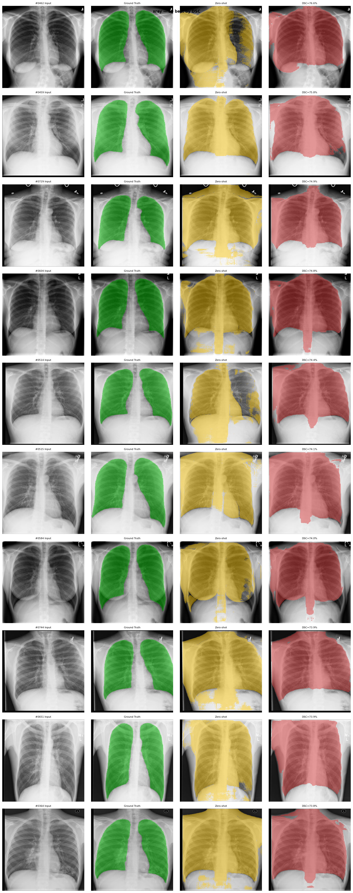
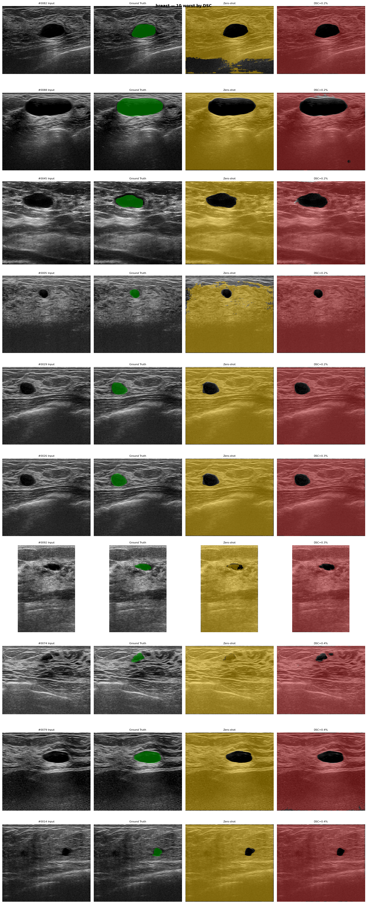

# MedCLIP-SAMv2 — Unofficial Replication

Unofficial Windows replication of **MedCLIP-SAMv2: Towards Universal Text-Driven Medical Image Segmentation** (Koleilat et al., 2024) on an RTX 4060 Ti (16 GB VRAM).

> Koleilat T., Asgariandehkordi H., Rivaz H., Xiao Y. (2024). MedCLIP-SAMv2: Towards Universal Text-Driven Medical Image Segmentation. arXiv:2409.19483.

Original paper code: https://github.com/HealthX-Lab/MedCLIP-SAMv2

---

## Pipeline

Three-stage weakly supervised segmentation:

1. **Stage 1 — BiomedCLIP fine-tuning**: domain adaptation via DHN-NCE contrastive loss on MedPix 2.0 + ROCO radiology image-text pairs.
2. **Stage 2 — Zero-shot segmentation**: M2IB saliency maps → Otsu thresholding + connected-component filtering → SAM ViT-H visual prompting (bbox or point prompts).
3. **Stage 3 — Weakly supervised nnUNet**: nnUNet trained on Stage 2 pseudo-labels using a cyclical LR schedule with Bayesian checkpoint ensemble (Zhao et al., 2022).

---

## Results

Replicated results vs. Table 1 of the paper (DSC %, higher is better):

| Dataset | ZS DSC (paper) | ZS DSC (ours) | WS DSC (paper) | WS DSC (ours) |
|---------|:--------------:|:-------------:|:--------------:|:-------------:|
| Breast US | 77.76% | 5.17% | 78.87% | 5.61% |
| Brain MRI | 76.52% | 4.86% | 80.03% | 5.01% |
| Lung X-ray | 75.79% | **50.01%** | 80.77% | **49.62%** |
| Lung CT | 80.38% | 7.93% | 88.78% | 9.04% |

> **X-ray** produces plausible segmentations (~50% DSC). The gap on breast/brain/CT is under
> investigation — M2IB saliency maps produce near-empty masks on those modalities despite the
> SAM coordinate fix being applied. The nnUNet trained on these poor pseudo-labels cannot
> recover meaningful segmentations.



*Breast (worst 10 cases — illustrating the open M2IB saliency issue):*



---

## File structure

```
config.py               Central config: all hyperparameters, paths, paper targets
datasets.py             Dataset loaders: MedPix, ROCO, BUSI, Brain, X-ray, CT
stage1_finetune.py      BiomedCLIP fine-tuning with DHN-NCE loss
stage2_segmentation.py  M2IB saliency → Otsu post-processing → SAM refinement
stage3_nnunet.py        nnUNet dataset prep, training, ensemble inference
cyclical_trainer.py     nnUNet custom trainer (cyclical LR + checkpoint saving)
evaluate.py             DSC, NSD, paired t-tests, all result tables
run_all.py              Master pipeline runner
visualize.py            Side-by-side prediction visualizations
verify.py               Pre-run data/model dependency checker
requirements.txt        Python dependencies
full_run.bat            Windows one-click launcher
```

---

## Setup

### 1. Hardware requirements

- GPU with ≥ 16 GB VRAM (tested: RTX 4060 Ti 16 GB)
- Python 3.11
- Windows 10/11 (Linux should work with minor path adjustments)

### 2. Install PyTorch

Install separately first to get the correct CUDA build:

```bash
# CUDA 12.x (RTX 40-series)
pip install torch torchvision --index-url https://download.pytorch.org/whl/cu121

# Verify
python -c "import torch; print(torch.cuda.get_device_name(0))"
```

### 3. Install dependencies

```bash
git clone <repo-url>
cd MedCLIP-SAMv2
python -m venv venv
venv\Scripts\activate        # Windows
# source venv/bin/activate   # Linux/macOS
pip install -r requirements.txt
```

### 4. Download SAM ViT-H weights

```bash
# ~2.4 GB — place at models/sam_vit_h_4b8939.pth
curl -L https://dl.fbaipublicfiles.com/segment_anything/sam_vit_h_4b8939.pth ^
     -o models\sam_vit_h_4b8939.pth
```

### 5. Download datasets

Place all data under `data/` using the layout below. Run `python verify.py` afterwards to
confirm everything is found correctly.

```
data/
  breast_tumors/
    train/{images/, masks/}   val/{images/, masks/}   test/{images/, masks/}
  brain_tumors/
    train/{images/, masks/}   val/{images/, masks/}   test/{images/, masks/}
  lung_Xray/
    train/{images/, masks/}   val/{images/, masks/}   test/{images/, masks/}
  lung_CT/
    train/{images/, masks/}   val/{images/, masks/}   test/{images/, masks/}
  medpix_dataset/
    images/   metadata.json
  roco-dataset-kaggle/
    all_data/{train/, validation/, test/}   (each with images/ and Captions.csv)
models/
  sam_vit_h_4b8939.pth
```

| Dataset | Source |
|---------|--------|
| Breast Tumors (BUSI / UDIAT) | Kaggle: `aryashah2k/breast-ultrasound-images-dataset` |
| Brain Tumors (Br35H) | Kaggle: `masoudnickparvar/brain-tumor-mri-dataset` |
| Lung X-ray (Montgomery + Shenzhen) | Kaggle: `nikhilpandey360/chest-xray-masks-and-labels` |
| Lung CT (LUNA16 subset) | Kaggle: `kmader/finding-lungs-in-ct-data` |
| MedPix 2.0 | https://medpix.nlm.nih.gov |
| ROCO | Kaggle: `virajbagal/roco-dataset` |
| SAM ViT-H | https://github.com/facebookresearch/segment-anything#model-checkpoints |

---

## Running

```bash
# Verify data layout and model weights
python verify.py

# Full pipeline — Windows one-click
full_run.bat

# Or step-by-step
python run_all.py                      # all 3 stages + evaluation
python run_all.py --skip-stage1        # resume from Stage 2 (BiomedCLIP already fine-tuned)
python run_all.py --eval-only          # re-run evaluation only
python run_all.py --dataset breast     # single dataset

# Visualize predictions (4-panel grids: input | GT | zero-shot | nnUNet)
python visualize.py --dataset breast --n 20
python visualize.py --dataset all
```

Results are saved to `working/results.json`. Visualizations go to `working/visualizations/`.

---

## Windows-specific fixes applied

Non-obvious issues encountered porting the pipeline to Windows — all already fixed in this repo:

| Issue | Fix |
|-------|-----|
| `UnicodeEncodeError` from nnUNet Unicode box-drawing chars | `set PYTHONIOENCODING=utf-8` in `full_run.bat` |
| DataLoader deadlock | `num_workers=0` in all DataLoaders |
| nnUNet CLI not found in venv subprocess | `Scripts/` dir injected into subprocess `PATH` |
| M2IB 224×224 masks → wrong SAM prompts | Saliency maps upscaled to original resolution before bbox/point extraction |
| Weakly supervised DSC = 0% | nnUNet outputs class-index PNGs (values 0/1); threshold changed from `> 127` to `> 0` |
| `TypeError: missing argument 'unpack_dataset'` | `nnUNetTrainerCyclicalLR.__init__` signature matched to installed nnunetv2 API |
| `AttributeError: 'NoneType'.step` crash | `on_train_epoch_start` override skips base-class `lr_scheduler.step()` call |

---

## Implementation notes

### DHN-NCE loss (paper equations 9–13)

The hardness weight exponent uses the **temperature-scaled** similarity `β · (I·T)/τ`, not the
raw dot product. At β=0.15 and τ=0.6 this gives `exp(0.25 · dot_product)`, producing sharper
hardness contrast than `exp(0.15 · dot_product)`.

### Fine-tuning epochs

The paper states LR=1e-6, 50% decay, batch=64 but does not specify epoch count. This
replication uses early stopping (patience=3, max 20 epochs).

### Cyclical LR schedule (nnUNet, Zhao et al. 2022)

The paper uses 3 cycles × 200 epochs = 600 epochs at 250 iterations/epoch. To fit within a
24-hour window on a single GPU, this replication uses 1 cycle × 200 epochs at 50
iterations/epoch. The LR shape and plateau checkpoint saving (10 checkpoints per cycle) are
preserved.

### Paired t-tests

Per the paper: "Paired-sample t-tests were conducted to validate observed trends, with p < 0.05
indicating statistical significance." All table comparisons include p-values via
`scipy.stats.ttest_rel`.

---

## Known limitations

- **UDIAT dataset** (breast validation/test): requires institutional access. If unavailable, use
  an 80/10/10 split of BUSI; breast numbers will differ from the paper.
- **M2IB saliency quality**: breast/brain/CT produce near-empty zero-shot masks in this
  replication (5–8% DSC vs 77–80% in the paper). Root cause is under investigation.
- **Reduced training compute**: 1 cycle × 50 iter/epoch instead of 3 cycles × 250 iter/epoch
  to meet timing constraints; may lower nnUNet ceiling.

---

## Citation

```bibtex
@article{koleilat2024medclipsamv2,
  title={MedCLIP-SAMv2: Towards Universal Text-Driven Medical Image Segmentation},
  author={Koleilat, Taha and Asgariandehkordi, Hojat and Rivaz, Hassan and Xiao, Yiming},
  journal={arXiv preprint arXiv:2409.19483},
  year={2024}
}
```
